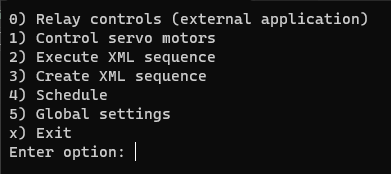
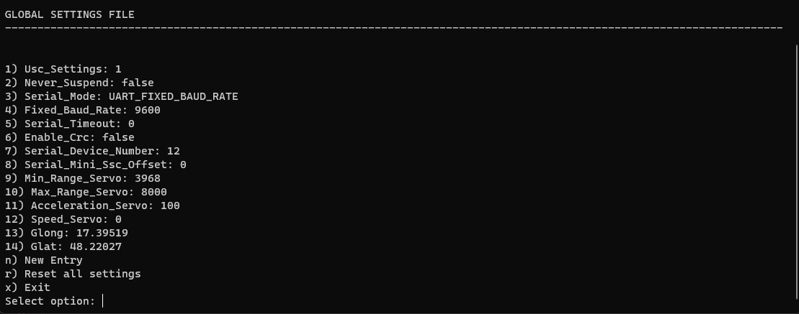

# CoverControl

<<<<<<< HEAD
<<<<<<< HEAD
Telescope automated remote control in a CLI form.

Application is operated in a CLI form on an interactive basis with main menu and other submenus being provided at any time. It aims to provide a one-stop environment for operating the telescope apparatus, and it enables executing custom workloads at custom times.

Let us go over each option of the main menu:

## 0) Relay Control

This enables executing an external application that enables the relay module. Author of this application has not been able to find any drivers of libraries they could use programmatically within the application, so they have resorted to providing a path to an external application.

## 1) Control servo motors

Enables control of specific servo motors on individual channels. It operates on a min/max scale that can be customized, as well as with speed and acceleration parameters (see below).

## 2) Execute XML sequence

Enables execution of a sequence provided within an XML file. User provides a path to the XML file, so that the execution may run.

## 3) Create XML sequence

User can create custom sequences that they can later execute, either manually (through option 2) or schedule it (through option 4).

## 4) Schedule

User can specify a workload to be executed upon sunset or sunrise (which are dynamically calculated), or they can schedule to run certain workloads at a custom time of the day they have specified.

## 5) Global Settings

This contains all the values used throughout the application in XML files, but they also allow customization of servo acceleration and speed, as well as specifying custom ranges for the hardware in question. User can also add custom properties or reset all of the values to their defaults. Lastly, they can use it to customize the longitude and latitude of their telescope.

=======
Telescope automated remote control in a CLI and GUI form
>>>>>>> d00d72e259d691af6210ac8032b39a4167b7a7cc
=======
Telescope automated remote control in a CLI and GUI form
>>>>>>> d00d72e259d691af6210ac8032b39a4167b7a7cc
